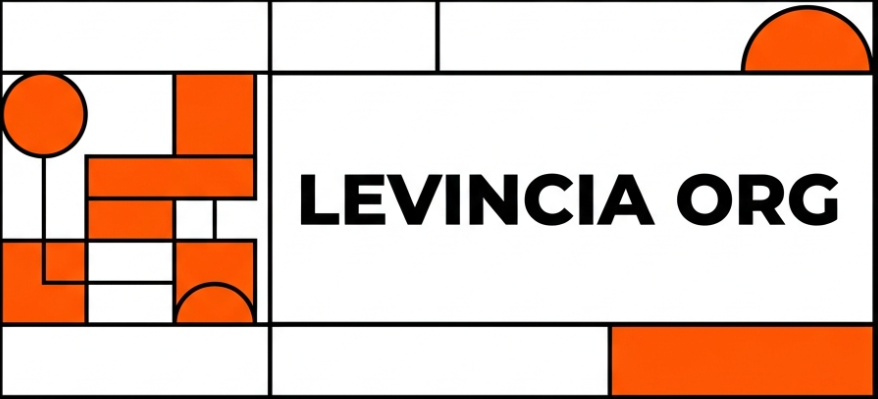
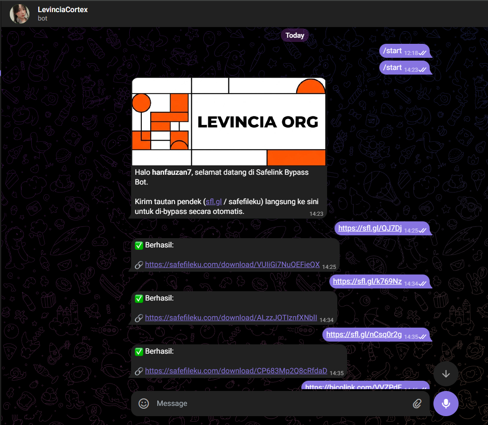

<!-- 
  LEVINCIA ORG - NEO-BRUTALIST README DESIGN
  Color Palette: Orange, Black, White. Sharp corners, bold text.
-->

  

    

  
<a href="README.md">🇮🇩 Versi Indonesia</a> | <b>🇬🇧 English Version</b>

   

  # 🚀 SAFELINK BYPASS CONTROL
  **Engineered by [Levincia Org]**

  
  

  *Automated engine to seamlessly bypass SafelinkU and Safefileku shortlinks directly. Fully integrated with Telegram for instant results without dealing with timers or pop-up traps.*

---

## ⚡ CORE FEATURES

- **[ 🗲 ] Instant Extraction** — Leave the built-in timers behind. Get the original download URL in milliseconds.
- **[ 🤖 ] Interactive Telegram Bot** — Runs autonomously on Telegram like your personal assistant. Try it out: [@lvcorg_bot](https://t.me/lvcorg_bot)
- **[ 🛡️ ] Proxy Rotation** — Stealthily evades anti-bot detection using thousands of rotating residential IPs.

---

## 📸 SYSTEM DEMO

  <a href="https://t.me/lvcorg_bot">
    <!-- Just upload your screenshot (named telegram-demo.png) alongside this README -->
    
  </a>
  
<i>Live testing via Levincia Telegram Bot</i>

---

## 🔗 QUICK LINKS

- **Try the Bot**: [t.me/lvcorg_bot](https://t.me/lvcorg_bot)
- **Organization**: Levincia Org

 

> **DISCLAIMER:**  
> This project is strictly developed for internal automation research purposes. Levincia Org assumes no responsibility for any misuse of the bypassing system that may disrupt third-party webservices.

  <b>[ EST. 2026 — SHARP, CLEAN, UNSTOPPABLE ]</b>

